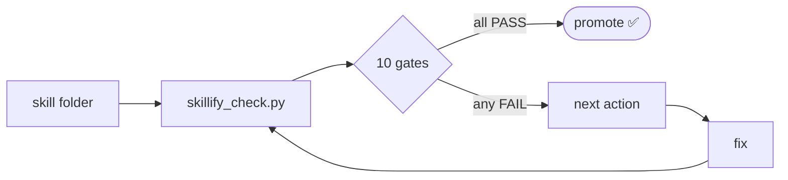

<div align="center">

# 🎯 skillify

### Audit any AI skill against **10 pass/fail gates**.

[](#)
[](#)
[](#)
[](#)

> *Hold humans responsible for judgment.* <br>
> *Hold tooling responsible for the checklist.*

</div>

---

## 🤔 Why

We're shipping AI skills weekly — recruiting screens, incident reviews, OKR scoring, design-doc reviews, town-hall slide builders.

Some have tests, evals, and smoke runs. Others have a `SKILL.md` and a prayer.

Without a shared bar, *"is this ready to ship?"* is a vibe check.

> [!IMPORTANT]
> **Skillify replaces the vibe check with a contract.**

---

## 🔁 The loop



---

## 🚦 The 10 gates

| | Gate | Pass criteria |
|---|------|---------------|
| 📜 | **G1** &nbsp; SKILL.md contract | Frontmatter has valid `name` and trigger-rich `description`; body states rules, workflow, and failure behavior. |
| ⚙️ | **G2** &nbsp; Deterministic code | Repeated or fragile work lives in `scripts/` as importable code, not LLM prose. |
| 🧪 | **G3** &nbsp; Unit tests | Every script has a matching offline test. No network, no credentials, no live endpoints. |
| 🔗 | **G4** &nbsp; Integration tests | Live behavior has an explicit harness with a clear command and credential-skip behavior. |
| 🎯 | **G5** &nbsp; LLM evals | Every LLM-owned judgment has golden cases, a rubric, and a judge harness. |
| 🛎️ | **G6** &nbsp; Resolver trigger | Description is trigger-rich; runtime metadata exists where the runtime needs it. |
| 🧭 | **G7** &nbsp; Resolver eval | Should-trigger and should-not-trigger prompts prove this skill is picked over siblings. |
| 🔍 | **G8** &nbsp; Resolvable / DRY audit | Markdown links resolve, references are reachable, no duplicated source of truth. |
| 💨 | **G9** &nbsp; E2E smoke test | One documented command exercises the skill through the same path the runtime uses. |
| 📁 | **G10** Filing rules | Durable artifacts in the skill folder; scratch under ignored `tmp/`; no rogue scratch reports. |

> [!WARNING]
> Every gate is binary. **`FAIL` means the skill is not promoted yet** — even if the missing work is "just" evidence.

---

## ⚡ One command

```bash
python3 skills/skillify/scripts/skillify_check.py skills/<target> --format markdown
```

That's it. Output is pass/fail per gate, with a concrete next action for every failure.

---

## 📦 What you get

**✅ When it passes:**

```text
# Skill Gate Check: skillify

Overall: PASS

## Passing gates
- G1  SKILL.md contract:           PASS
- G2  Deterministic code:          PASS
- G3  Unit tests:                  PASS
- G4  Integration tests:           PASS
- G5  LLM evals:                   PASS
- G6  Resolver trigger:            PASS
- G7  Resolver eval:               PASS
- G8  Resolvable and DRY audit:    PASS
- G9  E2E smoke test:              PASS
- G10 Filing rules:                PASS
```

**❌ When it doesn't:**

```text
Overall: FAIL

Failing gates:
- G5 LLM evals: no judge harness found.
  → Next: add 05-llm-evals/<domain>_llm_judge.py with golden cases.

- G7 Resolver eval: no route test found.
  → Next: add 07-resolver-evals/ prompts that should and should not trigger the skill.
```

> [!TIP]
> The **"Next:"** line is the whole point. Failures are not opinions — they are concrete fixes.

---

## 🧩 Seven skill types, one bar

The 10 gates are universal. *How* you satisfy them depends on the kind of skill you're building. Pick a type, then read [`references/patterns.md`](references/patterns.md) for what each variable gate has to look like.

| | Type | Shape |
|---|------|-------|
| ✏️ | **Mutation** | Writes / edits state in an external SaaS (Notion, Sheets, Linear, Chat). |
| 📅 | **Periodic report** | Reads from external systems and writes a recurring artifact on a schedule. |
| 🧠 | **Synthesis** | Reads from external systems and emits an analysis or recommendation on demand. |
| ⚖️ | **Review** | Looks at an existing artifact and emits a verdict, score, or issue list. |
| 🎨 | **Generation** | Generates novel structured content (slides, diagrams, drafts) from input. |
| 🛠️ | **Tool guide** | Documents how to drive an external CLI / desktop / browser tool. |
| 🪞 | **Meta** | Manages other skills, the framework, runtime, or developer plumbing. |

---

## 🪤 Why this shape

Every shortcut compounds.

| Skip | Consequence |
|------|------|
| **G2** | The next agent re-LLMs work that should be deterministic. |
| **G3** | Silent regressions land in production crons. |
| **G5** | Prompt drift is invisible until a stakeholder catches it. |
| **G7** | The resolver picks the wrong skill and the user blames the model. |
| **G9** | *"Works on my machine"* is the integration test. |

> [!CAUTION]
> Binary gates are the point. **A skill that's 8/10 isn't 80% ready — it's not promoted.**

---

## 🙏 Prior art

Skillify converged independently on the same 10-checklist shape Garry Tan documented in [`garrytan/gbrain/skills/skillify`](https://github.com/garrytan/gbrain/tree/master/skills/skillify) (April 2026). His framework targets the gbrain knowledge graph; this one targets the `agent-resources` skill folders.

**Same contract. Different runtime.**

---

<div align="center">

### 🏃 Run the checker. &nbsp; 📖 Read the failures. &nbsp; 🔧 Fix the failures. &nbsp; 🚀 Promote the skill.

</div>
